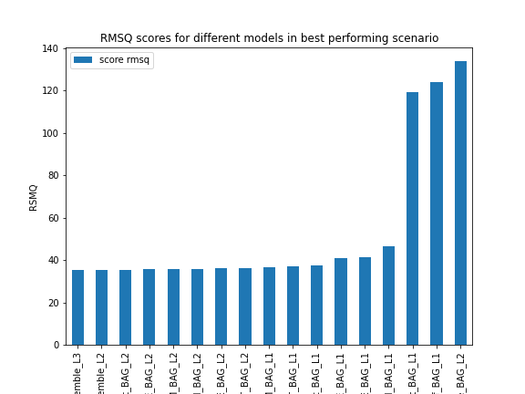
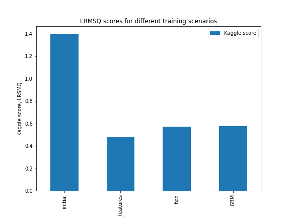

# Report: Predict Bike Sharing Demand with AutoGluon Solution
#### Jakub Porębski

## Initial Training
### What did you realize when you tried to submit your predictions? What changes were needed to the output of the predictor to submit your results?
When I first tried to submit my predictions I have accidentally written the same value into every entry of submission csv file. 
Suprisingly, evaluation of these results wasn't significantly worse. I got values 1.40 and 2.40, which for the first glance are not much worse than actual medium results or ~0.5. 
This took a bit to debug and I learned that even constant value can provide 'measurable' results

### What was the top ranked model that performed?
My top ranged model was a model with default hyperparameters and added new features. 

## Exploratory data analysis and feature creation
### What did the exploratory analysis find and how did you add additional features?
Exploratory data anailisis presented that there are some categorised features shich should be converted into numerical values. Also time stam data should be convrted into days/hours/minutes and stored as separate features for the model. I added additional features by appending extra columnt to the test dataset.

### How much better did your model preform after adding additional features and why do you think that is?
After addition of new features model performance improved from 1.4 to 0.48 in values of kaggle Root Mean Squared Logarithmic Error metric.
Splitting time domain into more easily understandable values decreased number of parameters that the model had to guess. Model should be focusing on predicting bike consuption, not on determining that each day has 24 hours, each lasting 60 minutes. Splitting datetime provided better results because bikes are usually used during daytime, which is measured by the hours. 
Bike riding is an outdoor activity, therefore weather will have significant impact on bike usage. Making this categorical feature undertandable to the model improved its performance therefore.

## Hyper parameter tuning
### How much better did your model preform after trying different hyper parameters?
Tuning hyperparameters does not improved training performance. As a newbie in the area of ML I am not familiar what is the meaning of each hyperparameter. Which one has some impact on this particular topic? Also changing one number and waiting 10 minutes for any results does not help in this tuning procedure. There must be some reasoning in this part of model tuning, I hope to learn that in the next topics covered by the course.

### If you were given more time with this dataset, where do you think you would spend more time?
I would look more closely at the data. Some parameters doesn't have any significant correlation with the results, they should be probably neglected during training. Learned models tend to rely on features hour, working day and datetime most.

Moreover I would apply the training using actual metric for the data evaluation - LRMSE instead or RMSE. Finally I would investigate hyperparameters for best performing models.

### Create a table with the models you ran, the hyperparameters modified, and the kaggle score.
I have divided performed experiments into three groups: obligatory table, learning time and further tuning.

Mandatory models results
|Idx|model        |eval_metric             |time_limit  |hyperparameters                        |score    |
|:-:|-------------|------------------------|:----------:|---------------------------------------|---------|
|0  |initial      |root_mean_squared_error |600         |default                                |1.39525  |
|1  |add_features |root_mean_squared_error |600         |default                                |0.47600  |
|2  |hpo          |root_mean_squared_error |600         |multimodal, 'batch_size':200,'lr':4    |0.57255  |

Impact of different time limits

|Idx|model         |time_limit  |hyperparameters                        |score    |
|:-:|--------------|:----------:|---------------------------------------|---------|
|0  |add_features  |200         |default                                |0.48903  |
|1  |add_features  |400         |default                                |0.48311  |
|2  |add_features  |600         |default                                |0.48056  |

Conclusion: for coarse parameter tuning shorter learning time can be selected.

Feature importance. Trained data seems to rely strongy on the 'datetime' column even when the 'hour', 'day' etc. features are avaiable. What will happen if we disable 'datetime' column?
|Idx|model         |time_limit  |hyperparameters                        |score    |
|:-:|--------------|:----------:|---------------------------------------|---------|
|0  |add_features  |200         |with 'datetime'                        |0.48903  |
|1  |add_features  |200         |without 'datetime'                     |0.55039  |

Actual performance drops down, therefore models infact prefer using raw datetime format for some cases.

Light BGM model tuning. 
In the initial training Light BGM showed best performance. Therefore sample hyperparameters tuning for this model was performed. Changed parameter was feature_fraction which describe percentage of features used for each tree. Lowering this parameter might  improve training speed and decrease overfitting.
|   |model         |time_limit  |hyperparameters                        |score    |
|:-:|--------------|:----------:|---------------------------------------|---------|
|0  |add_features  |200         | feature_fraction = 1.0 (default)      |0.56439  |
|1  |add_features  |200         | feature_fraction = 0.75               |0.58717  |
|2  |add_features  |200         | feature_fraction = 0.5                |0.64645  |
Conclusion: Hyperparameter feature_fraction should be left on default value 1.0 in order to reach best performance. 

### Create a line plot showing the top model score for the three (or more) training runs during the project.

### Create a line plot showing the top kaggle score for the three (or more) prediction submissions during the project.

## Summary
My top ranged model was a model with default hyperparameters and added new features. This result is probably caused by lack of knowledge in hyperparameters tuning. Hyperparameter tuning showed that learning time can be decreased for coarse hyperparameter tuning. The best performing model was Autogluon Weigted Enseble model followed by Cat Boost, Extra trees and Light BGM models. Addition of new features to the model improved performance of prediction significantly. 
